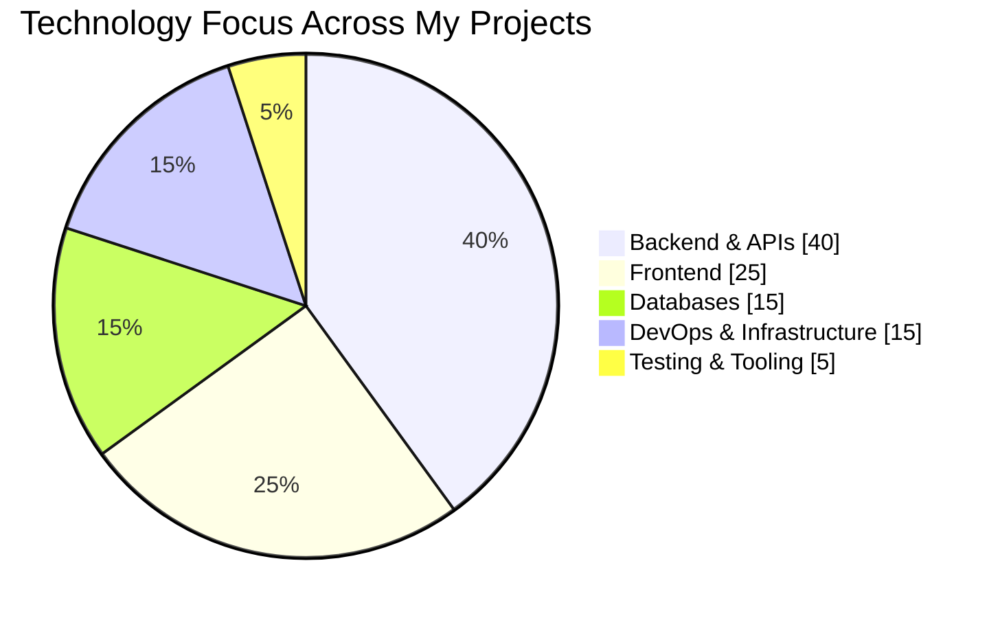

# 👋 Emilio Francisco Vázquez Pérez

<p align="center">
  
</p>

<p align="center">
  <a href="https://www.linkedin.com/in/emilio-francisco-vazquez-perez/">
    
  </a>
  <a href="mailto:emiliovpsis@gmail.com">
    
  </a>
  
</p>

<br>

## ⚡ Backend is where I build. Full Stack is where I deliver.

I'm a **Computer Systems Engineering student at TecNM en Celaya**, focused on building web applications, APIs and business systems.

My strongest area is **backend engineering**: designing APIs, working with relational databases, implementing authentication and business rules, and deploying applications in containerized environments.

I also enjoy connecting that backend with modern frontend technologies to build complete products.

<br>

<div align="center">

### 🧠 ENGINEERING PROFILE

<table>
<tr>
<td align="center" width="25%">

### ⚙️ Backend

**PHP · Python · Java**

Laravel · FastAPI · Spring Boot
REST APIs · JWT · RBAC

</td>

<td align="center" width="25%">

### 🗄️ Data

**PostgreSQL · Supabase**

SQL · ORM
Migrations · Relational Design

</td>

<td align="center" width="25%">

### 🐳 DevOps

**Docker · Linux**

Git · GitHub Actions
CI/CD · Server Deployment

</td>

<td align="center" width="25%">

### 🎨 Frontend

**React · Vue · Angular**

TypeScript · Vite
Tailwind · State Management

</td>
</tr>
</table>

</div>

<br>

---

# 🛠️ My Stack

<div align="center">

### Backend


<br><br>

### Databases & Infrastructure


<br><br>

### Frontend


<br><br>

### Tools


</div>

---

# 📊 Engineering Focus



<div align="center">

| 🧩 Area          | Technologies                                                 |
| :--------------- | :----------------------------------------------------------- |
| **Backend**      | PHP · Laravel · Slim · Python · FastAPI · Java · Spring Boot |
| **APIs**         | REST · JWT · Sanctum · Swagger/OpenAPI · Webhooks            |
| **Data**         | PostgreSQL · Supabase · MySQL · SQLAlchemy · Eloquent · JPA  |
| **Frontend**     | React · Vue · Angular · TypeScript · JavaScript              |
| **DevOps**       | Docker · Docker Compose · Linux · Bash · GitHub Actions      |
| **Testing**      | PHPUnit · Pest · pytest · pytest-asyncio                     |
| **Integrations** | Mercado Pago · Supabase · External REST APIs · PDF · Excel   |

</div>

> *The chart represents the areas that appear most consistently throughout my projects, rather than subjective skill percentages.*

---

# 🚀 Selected Projects

<div align="center">

<table>
<tr>

<td width="50%" valign="top">

<h2 align="center">🍕 Pronto Pizza</h2>

<p align="center">
<b>Full Stack Business Platform</b>
</p>

<p align="center">
A complete application combining a modern React frontend with a Python backend and PostgreSQL persistence.
</p>

<p align="center">


</p>

<p align="center">
<a href="https://github.com/EmilioVP72/Pronto_Pizza_Backend">Backend →</a>
&nbsp;&nbsp;|&nbsp;&nbsp;
<a href="https://github.com/EmilioVP72/Pronto_Pizza_Frontend">Frontend →</a>
</p>

</td>

<td width="50%" valign="top">

<h2 align="center">🏢 Soft Admin</h2>

<p align="center">
<b>Business Management Platform</b>
</p>

<p align="center">
Administrative system built with a Laravel backend and modern Vue frontend, focused on business workflows and data management.
</p>

<p align="center">


</p>

<p align="center">
<a href="https://github.com/EmilioVP72/Soft_Admin">View Project →</a>
</p>

</td>

</tr>

<tr>

<td width="50%" valign="top">

<h2 align="center">🔐 APIs Access</h2>

<p align="center">
<b>REST API Engineering</b>
</p>

<p align="center">
Backend service focused on REST APIs, validation, business rules, CRUD operations and bulk data management.
</p>

<p align="center">


</p>

<p align="center">
<a href="https://github.com/EmilioVP72/Apis_access">View Project →</a>
</p>

</td>

<td width="50%" valign="top">

<h2 align="center">🛒 E-Commerce</h2>

<p align="center">
<b>Laravel E-Commerce Platform</b>
</p>

<p align="center">
Application combining authentication, role-based permissions, payments, document generation and automated testing.
</p>

<p align="center">


</p>

<p align="center">
<a href="https://github.com/EmilioVP72/E-Commerce_Suplements">View Project →</a>
</p>

</td>

</tr>
</table>

</div>

---

# 🏗️ What I Like Building

<div align="center">

```text
                ┌─────────────────────┐
                │      BUSINESS       │
                │      PROBLEM        │
                └──────────┬──────────┘
                           │
                           ▼
                ┌─────────────────────┐
                │       BACKEND       │
                │                     │
                │ APIs · Logic · Auth │
                └──────────┬──────────┘
                           │
              ┌────────────┴────────────┐
              ▼                         ▼
       ┌──────────────┐          ┌──────────────┐
       │  DATABASE    │          │   SERVICES   │
       │              │          │              │
       │ PostgreSQL   │          │ REST / APIs  │
       │ Supabase     │          │ Payments     │
       └──────────────┘          └──────────────┘
              │                         │
              └────────────┬────────────┘
                           ▼
                ┌─────────────────────┐
                │       DOCKER        │
                │       LINUX         │
                │       CI / CD       │
                └─────────────────────┘
```

</div>

---

# 📈 GitHub Activity

<div align="center">


<br><br>


</div>

---

# 🌱 Currently Exploring

<div align="center">

**Backend Architecture**
`System Design` · `API Architecture` · `Security`

**Infrastructure**
`Docker` · `Linux` · `CI/CD` · `Cloud`

**Data**
`PostgreSQL` · `Database Design` · `Performance`

</div>

---

# 🎯 My Approach

<div align="center">

> **Build it. Understand it. Automate it. Improve it.**

I enjoy taking a real-world problem, turning it into a well-structured system,
and connecting the pieces from **database → backend → API → frontend → deployment**.

</div>

---

<p align="center">

### 🤝 Let's build something useful.

<a href="https://www.linkedin.com/in/emilio-francisco-vazquez-perez/">

</a>

<a href="mailto:emiliovpsis@gmail.com">

</a>

</p>

<p align="center">

</p>
